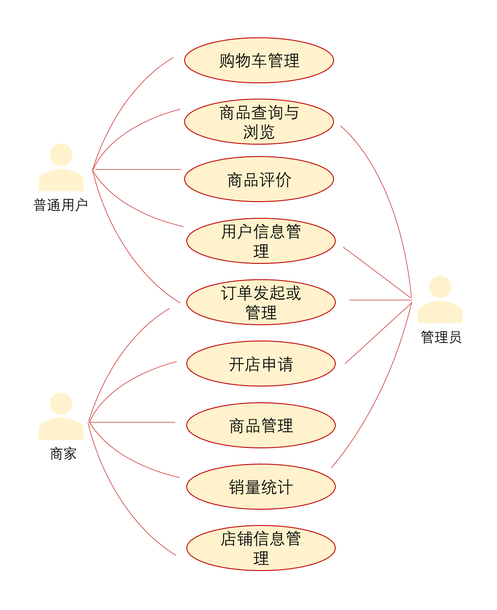
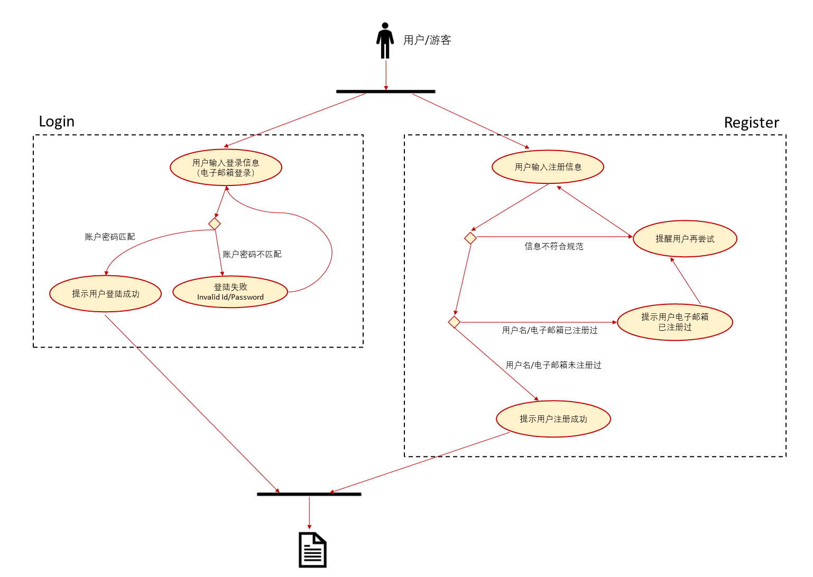
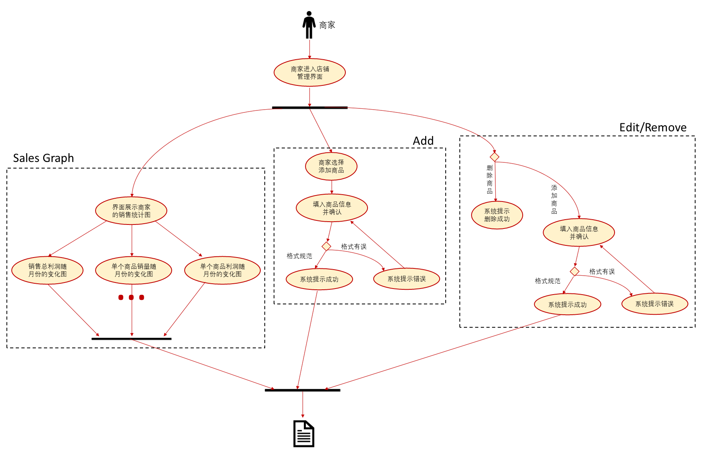

## 二、角色功能需求

### （一）总功能表与用例图

系统需实现以下功能：

|**功能名称**|**功能概诉**|
|:---|:---|
|商品查询与浏览|游客 / 用户对商品目录检索、关键词检索|
|购物车管理|用户对购物车内商品的添加、删除、更新|
|登陆与注册|游客注册；用户 / 管理员登陆，登录后用户只能查看到自己能使用的功能|
|用户信息管理|用户 / 管理员对用户信息的添加、删除、更新、查询|
|商品评价与查看|用户以已完成订单为依据对商品进行评价，系统可以对商品评价进行汇总|
|订单发起与管理|订单的发起、发货、确认收货、历史查询|
|开店申请|用户发起开店申请，管理员处理申请|
|店铺信息管理|商家 / 管理员对店铺信息的添加、删除、更新、查询|
|商品管理|商家对商品的添加、删除、更新、状态查看|
|销售统计|店铺内整体 / 单品销量和利润趋势 / 分布的统计|

为了保持用例图的简单，下面的用例图省去了登录与注册，也没有表现出合适的用户权限。

### （二）数据字典

数据字典描述要和系统交互的数据。

数据字典已移入数据库设计文档中。

### （三）不同实体功能设计

#### 1.游客 / 用户

##### 1.1 游客 / 用户登录与注册

游客 / 用户注册或登录的用例活动图如下：

##### 1.2 游客 / 用户商品浏览

系统要支持目录和关键词两种方式搜索。  
目录搜索指游客/用户可以通过网页头部的商品分类（如Electronic、Snack等）查看该分类下的所有商品。  
关键词搜索指游客/用户可以在搜索引擎中输入关键词（商家或商品的关键词）进行商品搜索。

##### 1.3 用户购物车管理

用户可以通过商品页面直接填加商品到购物车。在管理购物车时，可以修改商品数量，也可以直接删除商品。用户购物车在关闭浏览器或者退出登录后仍保留。

用户购物车管理用例活动图如下：

##### 1.4 用户个人信息管理

用户可以修改自己除用户名以外的任何个人信息，但不允许自主删除帐号。

##### 1.5 用户投诉商家与开店申请

用户若对商家或订单有所不满，可以以已有订单作为投诉依据。在发起投诉时，系统要提示用户先与商家沟通，减少系统中总投诉的数量。投诉由管理员处理。

用户若想通过此系统销售物品，可以通过发起开店申请。开店申请由管理员处理。

##### 1.6 用户发起订单

用户通过在购物车中挑选商品发起订单。

用户发起订单用例活动图如下：

##### 1.7 用户管理订单

用户在订单管理中心能看到自己所有状态的所有订单，但只能查看详细信息或对订单确认收货，不能删除订单。订单管理中心要提供用户按时间和按关键词两种查询方式。当用户确认收货时，不管当前订单状态是什么，标识着一个订单的结束。订单完成或后用户可以立即或稍后对商品进行评价，评价将影响店铺评价等级。

#### 2. 商家

##### 2.1 店铺信息管理

商家可以修改自己店铺信息，不允许自主删除店铺。

##### 2.2 商品管理与销售统计

商家可以对自己店铺内的商品进行添加、修改、删除。商家可以对指定产品进行定时打折，可以指定打折后的金额或打折的比例。当商家删除商品时，系统要保留数据，以备后用。  
销售统计要产生报表，包括对店铺内整体、单个商品销售情况统计：

1. 整体销售统计：
	- 商品利润分布（饼图）。
	- 商品销量分布（饼图）。
	- 总销量趋势（折线图）。
	- 总利润趋势（折线图）。
1. 单个商品销售统计：
	- 销量趋势（条形图）。
	- 利润趋势（条形图）。

商家商品管理与销售统计用例活动图如下：

#### 3. 管理员

管理员不能自主注册，只能通过给定的帐号进行登录。

##### 3.1 登录

管理员登录时候供编号和密码。

##### 3.2 对用户信息管理

管理员可以通过用户手机号或用户名或昵称来定位用户。管理员可以添加系统用户、修改任何用户的个人信息，也可以删除任何用户。当管理员删除用户时，系统要保留数据，以备后用。

##### 3.3 处理投诉 / 申请

管理员在处理投诉 / 申请时，要能直接点击订单号获取订单详细信息。

投诉 / 申请由用户发起，由管理员处理 / 拒绝。

管理员处理投诉与开店申请用例活动图如下：

##### 3.4 查询订单

所有订单的所有状态对管理员可见。管理员可以通过订单号查询订单、查看订单详细信息，但不可操作订单状态。

查询订单过程过于简单，不提供用例活动图。

##### 3.5 对店铺信息管理

管理员可以修改任何店铺信息，可以删除任何店铺。当管理员删除店铺时，系统要保留数据，以备后用。
